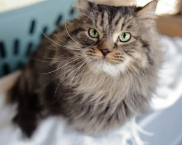
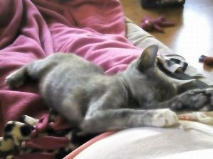

## Goal
Create algorithm to detect cat breed

## Data
I used the [cat breed dataset from kaggle](https://www.kaggle.com/ma7555/cat-breeds-dataset). 

However, the dataset came with a few challenges:
1. Imbalanced data
    - There are 53,027 images for "Domestic Short Hair" breed. Most breeds have less than 1,000 images

2. Incorrect images (?)
    - Admittedly, I am no cat expert, but few images for  "Munchkin" seem to be incorrect

> Munchkin??

> Munchkin??

## Notebooks

`cat_breed_detector-v0.1.ipynb`: Pilot run with [cat breed dataset from kaggle](https://www.kaggle.com/ma7555/cat-breeds-dataset)

`cat_breed_detector-v0.0.ipynb`: Second run on the same dataset, with oversampling.  

`cat_breed_detector-v0.1.ipynb`